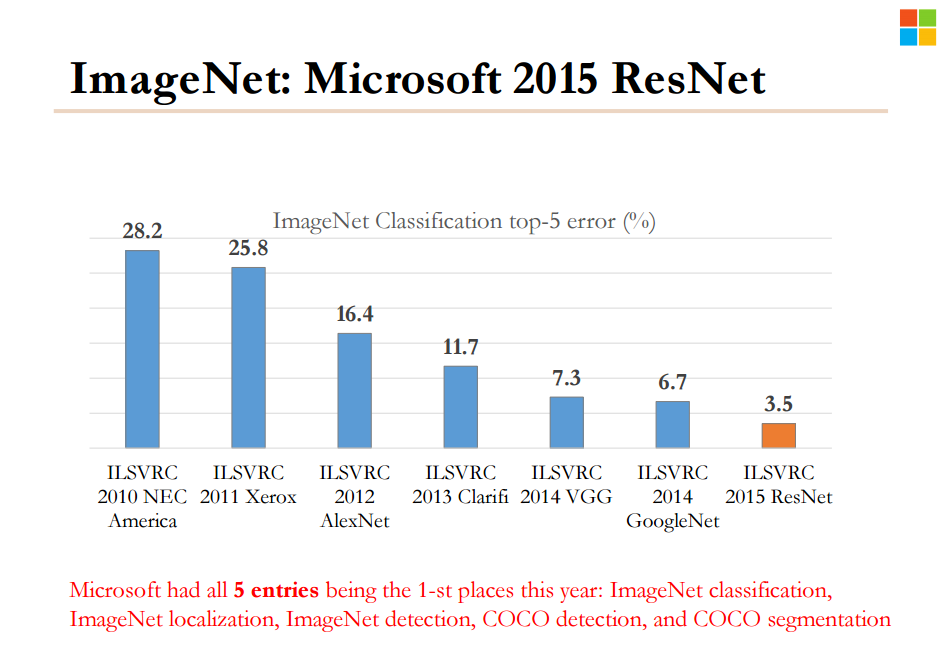
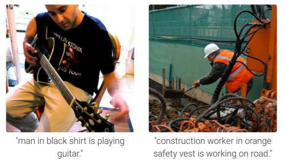

# applied-deep-learning-resources
Collection of research articles, blog posts and code snippets about deep learning that can be useful in applied settings. Ideally ready made models and methods which can be used out of the box. Mainly focusing on CNNs and DQNs but RNNs and other interesting things will be present as well.

# CNN

Latest overview of the CNNs can be found from the paper *"Deep learning for visual understanding: A review"* [[link](http://www.sciencedirect.com/science/article/pii/S0925231215017634), [PDF](articles/Deep learning for visual understanding A review.pdf)]

Another decent overview in Nature by LeCun, Bengio and Hinton: *"Deep learning"* [[link](http://www.nature.com/nature/journal/v521/n7553/full/nature14539.html), [PDF](https://www.docdroid.net/11p1b/hinton.pdf.html)]

## ImageNet
[ImageNet](http://www.image-net.org/) is the most important image classification and localization competition. Other data sets with results can be found from here: *"Discover the current state of the art in objects classification."* [[link](http://rodrigob.github.io/are_we_there_yet/build/classification_datasets_results.html)].

Prediction error of the ImageNet competition has been decreasing rapidly over the last 5 years:

## Main network architectures

### AlexNet

Original paper: *"ImageNet Classification with Deep Convolutional Neural Networks"* [[PDF](http://www.cs.toronto.edu/~fritz/absps/imagenet.pdf)]

Properties: 7 layers (5 convolutional and 2 fully connected), Rectified Linear Units (ReLUs),  Local Response Normalization, Dropout

### VGG

Original paper:

Properties: 

### GoogLeNet

Original paper: *"Going deeper with convolutions"* [[arxiv](http://arxiv.org/abs/1409.4842)]

Properties: 22 layers, Inception modules, 1x1 conv layers, ReLUs, Dropout, Mid-level outputs

### ResNet

Original paper: *"Deep Residual Learning for Image Recognition"* [[arxiv](http://arxiv.org/abs/1512.03385)]

Properties: Batch Normalization (See *"Batch Normalization: Accelerating Deep Network Training by Reducing Internal Covariate Shift"* [[arxiv](http://arxiv.org/abs/1502.03167)])

Main building block of the best network:

### Other architectures

* Deep Learning for 3D shapes: *"3D ShapeNets: A Deep Representation for Volumetric Shapes"* [[PDF](http://people.csail.mit.edu/khosla/papers/cvpr2015_wu.pdf)]

* Code and a model for faces: *"Free and open source face recognition with deep neural networks."* [[github](https://github.com/cmusatyalab/openface)]

* Fast neural networks which can perform arbitrary filters for images: *"Deep Edge-Aware Filters"* [[PDF](http://jmlr.org/proceedings/papers/v37/xub15.pdf)]

* Lot's of different models in Caffe's *"Model Zoo"* [[github](https://github.com/BVLC/caffe/wiki/Model-Zoo)]

## Framework benchmarks

* *"Comparative Study of Caffe, Neon, Theano and Torch for deep learning"* [[arxiv](http://arxiv.org/pdf/1511.06435v1.pdf)]

Their summary: From our experiments, we observe that Theano and Torch are the most easily extensible frameworks. We observe that Torch is best suited for any deep architecture on CPU, followed by Theano. It also achieves the best performance on the GPU for large convolutional and fully connected networks, followed closely by Neon. Theano achieves the best performance on GPU for training and deployment of LSTM networks. Finally Caffe is the easiest for evaluating the performance of standard deep architectures.

* soumith/convnet-benchmarks: [[github](https://github.com/soumith/convnet-benchmarks)]

* *"Deep Learning Libraries by Language"* [[link](http://www.teglor.com/b/deep-learning-libraries-language-cm569/)]

## Feature learning

* *"CNN Features off-the-shelf: an Astounding Baseline for Recognition"* [[arxiv](http://arxiv.org/abs/1403.6382)]

* Faster and better features: *"Efficient Deep Feature Learning and Extraction via StochasticNets"* [[arxiv](http://arxiv.org/pdf/1512.03844.pdf)]

## Object detection

* *"Object Detectors Emerge in Deep Scene CNNs"* [[PDF](http://people.csail.mit.edu/khosla/papers/cvpr2015_wu.pdf)]

## Other 

* Google Deep Dream or neural networks on LSD: *"Inceptionism: Going Deeper into Neural Networks"* [[link](http://googleresearch.blogspot.ch/2015/06/inceptionism-going-deeper-into-neural.html), [deepdreamer.io/](http://deepdreamer.io/)]

Deep dreaming from noise:

* Code and models for mixing arbitrary content and art style: *"A Neural Algorithm of Artistic Style"* [[arxiv](http://arxiv.org/abs/1508.06576), [deepart.io](http://deepart.io/), [a blog post](http://mlg.eng.cam.ac.uk/lloyd/blog-2015-09-01-neural-art.html), [github.com/jcjohnson/neural-style](https://github.com/jcjohnson/neural-style)]

* Code and models for automatic captions of images: *"Deep Visual-Semantic Alignments for Generating Image Descriptions"* [[web poster](http://cs.stanford.edu/people/karpathy/deepimagesent/), [PDF](http://cs.stanford.edu/people/karpathy/cvpr2015.pdf), [github](https://github.com/karpathy/neuraltalk2)]

* *"Learning visual similarity for product design with convolutional neural networks"* [[PDF](http://www.cs.cornell.edu/~kb/publications/SIG15ProductNet.pdf)]

* Using images and image descriptions to improve search results: "*Images Don’t Lie: Transferring Deep Visual Semantic Features to Large-Scale Multimodal Learning to Rank*" [[arxiv](http://arxiv.org/abs/1511.06746)]

* *"How Google Translate squeezes deep learning onto a phone"* [[post](http://googleresearch.blogspot.co.uk/2015/07/how-google-translate-squeezes-deep.html)]

* *"What a Deep Neural Network thinks about your #selfie"* [[blog](http://karpathy.github.io/2015/10/25/selfie/)]

Top selfies according to the ConvNet:

* *"Recommending music on Spotify with deep learning"* [[github](http://benanne.github.io/2014/08/05/spotify-cnns.html)]

# DQN

My popular science article about DQN: *"Artificial General Intelligence that plays Atari video games: How did DeepMind do it?"* [[link](http://robohub.org/artificial-general-intelligence-that-plays-atari-video-games-how-did-deepmind-do-it/)]

* DQN for RoboCup: *"Deep Reinforcement Learning in Parameterized Action Space"* [[arxiv](http://arxiv.org/abs/1511.04143)]

# RNN

Very good tutorial-like introduction to RNNs by Andrej Karpathy: *"The Unreasonable Effectiveness of Recurrent Neural Networks"* [[link](http://karpathy.github.io/2015/05/21/rnn-effectiveness/)]

## Other

* *"Visualizing and Understanding Recurrent Networks"* [[arxiv](http://arxiv.org/abs/1506.02078)]

* *"Composing Music With Recurrent Neural Networks"* [[blog](http://www.hexahedria.com/2015/08/03/composing-music-with-recurrent-neural-networks/)]

# Other promising or useful architectures

* HTMs by Jeff Hawkins: *"Continuous online sequence learning with an unsupervised neural network model"*​ [[arxiv](http://arxiv.org/pdf/1512.05463v1)]

* Word2vec: *"Efficient Estimation of Word Representations in Vector Space"* [[arxiv](http://arxiv.org/abs/1301.3781), [Google code](https://code.google.com/p/word2vec/)]

# AI organisations

* [OpenAI](https://openai.com/)

# Other lists
* *"An awesome list of (large-scale) public datasets on the Internet. (On-going collection)"* [[github](https://github.com/caesar0301/awesome-public-datasets)]

* *"Model Zoo"* [[github](https://github.com/BVLC/caffe/wiki/Model-Zoo)]

* Videos from *"Deep Learning Summer School, Montreal 2015"*: [http://videolectures.net/deeplearning2015_montreal/](http://videolectures.net/deeplearning2015_montreal/)

* [http://deeplearning.net/](http://deeplearning.net/)