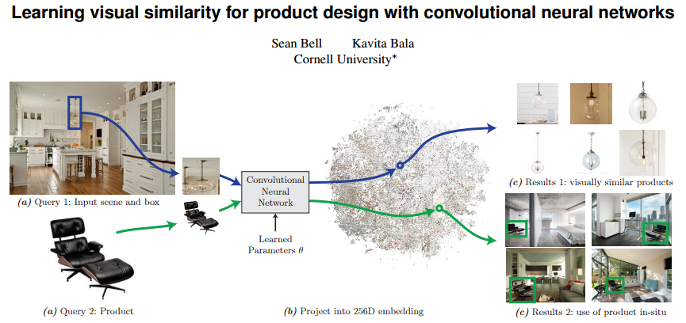

# applied-deep-learning-resources
Collection of research articles, blog posts and code snippets about deep learning that can be useful in applied settings. Ideally ready made models and methods which can be used out of the box. Mainly focusing on CNNs and DQNs but RNNs and other interesting things will be present as well.

# CNN

Latest overview of the CNNs can be found from the paper *"Deep learning for visual understanding: A review"* [[paper](http://www.sciencedirect.com/science/article/pii/S0925231215017634), [PDF](articles/Deep learning for visual understanding A review.pdf)]

Another decent overview in Nature by LeCun, Bengio and Hinton: *"Deep learning"* [[link](http://www.nature.com/nature/journal/v521/n7553/full/nature14539.html), [PDF](https://www.docdroid.net/11p1b/hinton.pdf.html)]

## ImageNet
[ImageNet](http://www.image-net.org/) is the most important image classification and localization competition. Prediction error has been decreasing rapidly for the last 5 years:

## Main network architectures

### AlexNet

Original paper: 

Properties: 

### VGG

Original paper:

Properties: 

### GoogleNet

Original paper: *"Going deeper with convolutions*" [[arxiv](http://arxiv.org/abs/1409.4842)]

Properties: 

### ResNet

Original paper: *"Deep Residual Learning for Image Recognition"* [[arxiv](http://arxiv.org/abs/1512.03385)]

Properties: 

### Others

* Deep Learning for 3D shapes: *"3D ShapeNets: A Deep Representation for Volumetric Shapes"* [[PDF](http://people.csail.mit.edu/khosla/papers/cvpr2015_wu.pdf)]

* Code and models for automatic captions of images by Karpathy [[github](https://github.com/karpathy/neuraltalk2)]

* Code and a model: *"Free and open source face recognition with deep neural networks."* [[github](https://github.com/cmusatyalab/openface))]

* *"Learning visual similarity for product design with convolutional neural networks"* [[PDF](http://www.cs.cornell.edu/~kb/publications/SIG15ProductNet.pdf)]

* *"How Google Translate squeezes deep learning onto a phone"* [[post](http://googleresearch.blogspot.co.uk/2015/07/how-google-translate-squeezes-deep.html)]

* Fast neural networks which can perform arbitrary filters for images: *"Deep Edge-Aware Filters"* [[PDF](http://jmlr.org/proceedings/papers/v37/xub15.pdf)]

## Framework benchmarks

* *"Comparative Study of Caffe, Neon, Theano and Torch for deep learning"* [[arxiv](http://arxiv.org/pdf/1511.06435v1.pdf)]

Their summary: From our experiments, we observe that Theano and Torch are the most easily extensible frameworks. We observe that Torch is best suited for any deep architecture on CPU, followed by Theano. It also achieves the best performance on the GPU for large convolutional and fully connected networks, followed closely by Neon. Theano achieves the best performance on GPU for training and deployment of LSTM networks. Finally Caffe is the easiest for evaluating the performance of standard deep architectures.

* soumith/convnet-benchmarks: [[github](https://github.com/soumith/convnet-benchmarks)]

* *"Deep Learning Libraries by Language"* [[link](http://www.teglor.com/b/deep-learning-libraries-language-cm569/)]

## Feature learning

* *"CNN Features off-the-shelf: an Astounding Baseline for Recognition"* [[arxiv](http://arxiv.org/abs/1403.6382)]

* Faster and better features: *"Efficient Deep Feature Learning and Extraction via StochasticNets"* [[arxiv](http://arxiv.org/pdf/1512.03844.pdf)]

## Object detection

* *"Object Detectors Emerge in Deep Scene CNNs"* [[PDF](http://people.csail.mit.edu/khosla/papers/cvpr2015_wu.pdf)]

## Fun

### Google Deep Dream

Original post: *"Inceptionism: Going Deeper into Neural Networks"* [[link](http://googleresearch.blogspot.ch/2015/06/inceptionism-going-deeper-into-neural.html)]

[deepdreamer.io/](http://deepdreamer.io/)

### Art styles

Original paper: *"A Neural Algorithm of Artistic Style"* [[arxiv](http://arxiv.org/abs/1508.06576)

Other resources: [deepart.io/](http://deepart.io/), [a blog post](http://mlg.eng.cam.ac.uk/lloyd/blog-2015-09-01-neural-art.html), [github.com/jcjohnson/neural-style](https://github.com/jcjohnson/neural-style)

### Other

* *"What a Deep Neural Network thinks about your #selfie"* [[blog](http://karpathy.github.io/2015/10/25/selfie/)]

* *"Recommending music on Spotify with deep learning"*[[github](http://benanne.github.io/2014/08/05/spotify-cnns.html)]

# DQN

My popular science article about DQN: *"Artificial General Intelligence that plays Atari video games: How did DeepMind do it?"* [[link](http://robohub.org/artificial-general-intelligence-that-plays-atari-video-games-how-did-deepmind-do-it/)]

* DQN for RoboCup: *"Deep Reinforcement Learning in Parameterized Action Space"* [[arxiv](http://arxiv.org/abs/1511.04143)]

# RNN

Very good tutorial-like introduction to RNNs by Andrej Karpathy: *"The Unreasonable Effectiveness of Recurrent Neural Networks"* [[link](http://karpathy.github.io/2015/05/21/rnn-effectiveness/)]

## Fun

* *"Visualizing and Understanding Recurrent Networks"* [[arxiv](http://arxiv.org/abs/1506.02078)]

* *"Composing Music With Recurrent Neural Networks"* [[blog](http://www.hexahedria.com/2015/08/03/composing-music-with-recurrent-neural-networks/)]

# Other architectures

* HTMs by Jeff Hawkins: *"Continuous online sequence learning with an unsupervised neural network model"*​ [[arxiv](http://arxiv.org/pdf/1512.05463v1)]

* Word2vec: *"Efficient Estimation of Word Representations in Vector Space"* [[arxiv](http://arxiv.org/abs/1301.3781), [Google code](https://code.google.com/p/word2vec/)]

# AI organisations

* [OpenAI](https://openai.com/)

# Other lists
* *"An awesome list of (large-scale) public datasets on the Internet. (On-going collection)"* [[github](https://github.com/caesar0301/awesome-public-datasets)]
* Videos from "Deep Learning Summer School, Montreal 2015": [http://videolectures.net/deeplearning2015_montreal/](http://videolectures.net/deeplearning2015_montreal/)
* [http://deeplearning.net/](http://deeplearning.net/)